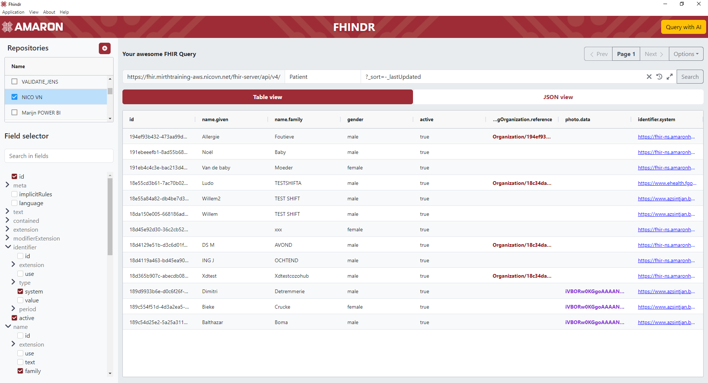
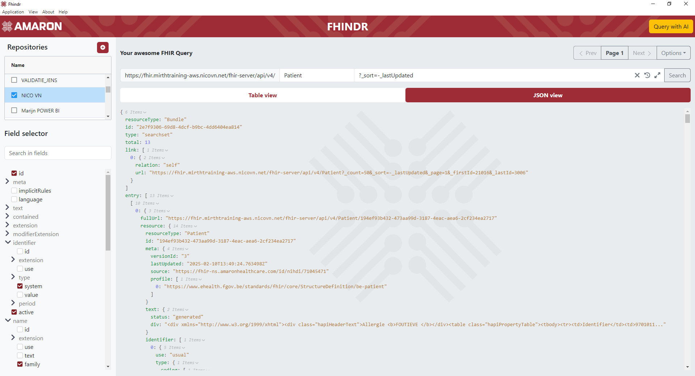
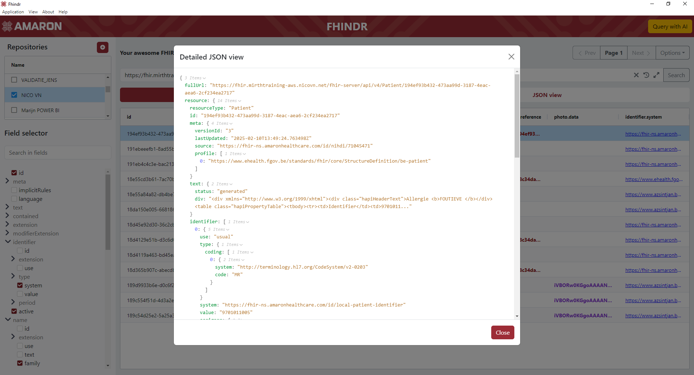

 

# FHINDR

[![Github Tag][github-tag-image]][github-tag-url]

- [Introduction](#introduction)
- [Installation](#installation)
- [User guide](#user-guide)
- [Known limitations](#known-limitations)
- [Support](#support)
- [License Attribution](#license-attribution)

 

## Introduction

Fhindr is a visualization tool for FHIR (Fast Healthcare Interoperability Resources) created by Amaron. It was designed to make getting an overview
of the contents of a FHIR repo easy and fast.
Without the need of manually querying the repository using a REST client.

View a quick demo of Fhindr [here.](https://www.youtube.com/watch?v=TDdmA6vb1AE)

 

## Installation

Fhindr is available for Windows and Mac, installers for the latest release can be found [here](https://github.com/amaron-team/fhindr/releases/latest).

 

## User guide

When starting the application, a new repository connection can be added by pressing the + button in the top left. There is also an import button available if already have an existing configuration file.

 

Right-clicking the repository name will allow you to edit, clone or delete the connection.

### Authentication

Fill out the required connection details, currently there are 2 supported methods of authenticating with a FHIR repository.
Based on what type of authentication is chosen, the required fields will vary. 
_(If the repository doesn't require authentication, name and base url will be the only required fields.)_

- Client secret authentication: Easiest and most well know authentication, only requires a client id and secret. Depending on the repository, scope and audience might be required.  
  

 

- Private key JWT: Most secure authentication, but not supported by all FHIR repositories, requires a private and public (jwks) key.  
  

 

- Authentication code: Interactive authentication, will open an authentication window where a user login is expected. Requires an authorization url and redirect url. optionally a client secret can be used as well  

 

- In version 1.1.0 session authentication was added, turn off remember credentials in the repository config to only safe the credentials for current session. _This requires the current credentials to be deleted._  
  

### Visualizing data

After saving the new repository, it will now be available for connection in the repository table. Clicking the name of the repository once will activate the connection and
open up the query window. **Double-clicking** the name will open the configuration back up in case any connection parameters need to be updated. When editing the existing
repo connection there will also be a trash icon in the top left to delete the repository from the list of known connections.

With the query editor now available, you can select the base resource you would like to visualize and add any additional FHIR query. Selecting a resource will display the
field selector and pre-fill the query field.

In the field selector you can customize exactly how you would like the FHIR resource to be displayed. Selecting any field from the resource tree will visualize it table form.

By clicking search the repository will be queried and the selected fields will be displayed. Any field selection change will update the table live.
You can easily switch between the table view and the raw JSON representation of the FHIR resource by clicking the tabs.

 

From version 1.1 onward includes, revincludes and everything queries.

### Data interaction

To see the detailed JSON view of a specific record, any record can be **double-clicked**

Additionally, some FHIR resources can contain special fields, these fields can be interacted with.

- Links to FHIR definitions  => These will be highlighted in blue and can be clicked to take you directly to the link.
   
   
    
- FHIR references to linked resources 
  => These will be highlighted in red and can be clicked to show the JSON view of the linked resource without having to manually query the repository again
   
   
    
- Export table data to excel  => When a table is loaded, go to options in the top right and press "Export current selection"
   
   
    
- Some FHIR repositories can contain base64 encoded images or pdf files. If Fhindr detects these, they will be purple in the table view. By clicking on them, you can see the contents rendered.

### Query history and favorites

- Click the history icon in the search bar to see the 5 most recent queries. Want to save a query for later? Click the star icon to save it.

### Advanced settings

In the advanced options are available. These can be found by going to the repo settings and clicking the "Advanced settings" tab.

-  Export settings: You can export your configuration either to the clipboard or to a file. The export will always be without 
client secret or private keys. If you would like to copy an existing connection including the secrets, right-click the repo and 
clone the existing connection instead.

- Default search query: By default the `?_sort=-_lastUpdated` query parameters will be used when no query has been manually entered yet. 
If you want to change what is used as the default, you can configure it here.

- Custom page size: This will add the `_count` parameter to the query so the FHIR repository knows how many pages to send back.
Setting the `_count` in the query field manually will override this setting, leaving it blank won't add anything to the query.

- Amaron tracing parameters: If Fhindr detects that you're sending requests to an Amaron FHIR Station, 2 additional options will be available to enable tracing.

- Send queries as POST: Some FHIR server block the use of GET queries, enabling this option will convert all request to POST requests in the backend.

- Pseudonymization endpoint: It's possible to configure a pseudonymization endpoint to pseudomize patient identifiers before sending them to the repo.
If an url is configured here, Fhindr will automatically send blinded EC Point x & y coordinates to the endpoint. When there is a successful response with a new blinded point, 
Fhindr will unblind the points and replace the identifier in the request with the encoded result.

- Custom JWT token extensions: Some FHIR repositories or specific calls might require end-user information when sending the request. 
Any JSON object put in this field will be added to the JWT token as an extensions when requesting tokens. For example the `ihe_iua` JWT extensions can be added here.
 
### AI integration

Since it can be quite hard to know exactly what queries to write, we added an AI integration that can help write the FHIR queries.
When connected to a repository a "Query with AI" button will appear in the top right.

Currently, there are 2 supported AI models that can be used. gpt-3.5-turbo-0125 and gpt-4o You will need an API key to use these models.
The keys can be obtained [here](https://platform.openai.com/settings/organization/billing/overview) and the keys can be configured by clicking on the gear icon.

  

When the key is configured, you can just describe the query you would like and the AI model will generate the query for you. Some example questions are already present.

  

Keep in mind that AI models can make mistakes, so some small syntax errors might be possible. You can always press the generate button again to let the model retry the question.

  

By clicking on "Try it out", the query will automatically be filled in the query editor and the data can be requested.

 

## Known limitations

- XML formatting is not supported, all requests will default to JSON and if XML formatting is explicitly requested in the query,
the table view won't be shown. The JSON view tab will display the XML data as a string. A warning will pop up when requesting XML format.
 

## Support

Bugs or problems while using Fhindr can be reported on our [issues page.](https://github.com/amaron-team/fhindr/issues)

For more information about our FHIR integration projects, visit our [website](https://amaron.be), follow us on [LinkedIn](https://www.linkedin.com/company/amaron/mycompany), or contact us at connect@amaron.be.
 

## License Attribution

This project uses third-party libraries that are licensed under the MIT License and other open-source licenses.
The licenses of direct dependencies are listed in the `licenses/` folder.

Please note that this project may also include transitive dependencies with their own licenses.

[github-tag-image]: https://img.shields.io/github/v/tag/amaron-team/fhindr.svg?label=Version&sort=semver
[github-tag-url]: https://github.com/amaron-team/fhindr/releases/latest
