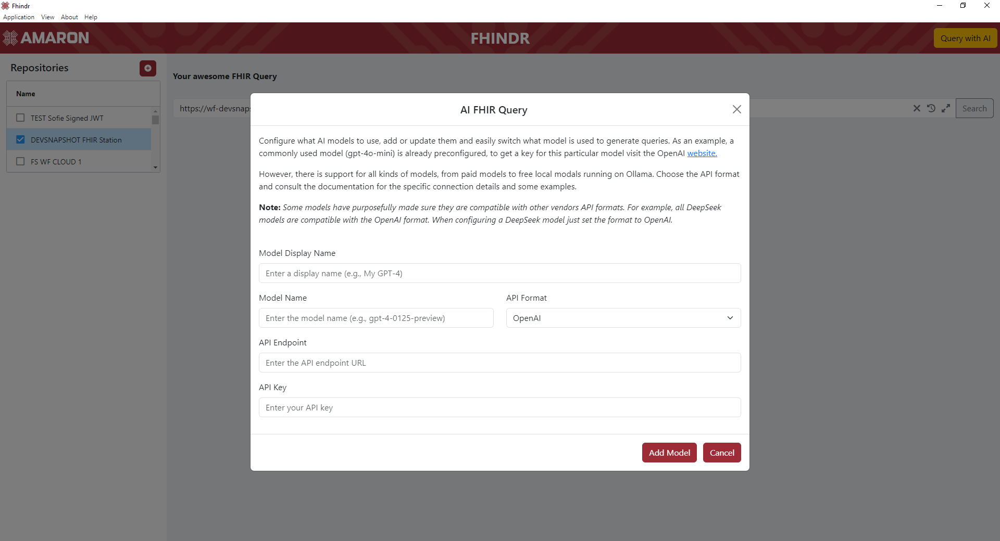

 

# FHINDR

[![Github Tag][github-tag-image]][github-tag-url]

- [Introduction](#introduction)
- [Installation](#installation)
- [User guide](#user-guide)
- [Known limitations](#known-limitations)
- [Support](#support)
- [License Attribution](#license-attribution)

 

## Introduction

Fhindr is a visualization tool for FHIR (Fast Healthcare Interoperability Resources), developed by Amaron. 
It is designed to provide a quick and effortless overview of the contents of a FHIR repository, eliminating the need for manually querying with a REST client.

View a short demo of Fhindr [on YouTube](https://www.youtube.com/watch?v=TDdmA6vb1AE).

 

## Installation

Fhindr is available for Windows, Mac and Linux. Installers for the latest release can be found [here](https://github.com/amaron-team/fhindr/releases/latest).

 

## User guide

### Configuring a new repository

To add a new repository connection after starting the application, click the "+" button in the top-left corner.
On the repository configuration screen you can choose to fill in the repository details manually, or you can click the import button.

 
 

### Importing existing configuration

Repositories can be imported using JSON or by importing an exported configuration file.

 
 

### Manual configuration

#### General settings

- Name: A name for the repository connection, this will be the name displayed in the repository list.
- Store credentials: With this option you can decide whether the credentials of the repository should be securely saved in the backend and be persisted after reload, 
or if they should only be available in the active session. When this setting is unchecked the repository credentials will be requested during the first request.
The active session credentials can always be reset by going to the "Help" menu and clicking "Reset session credentials".
- Base FHIR url: This is the FHIR endpoint of the server you will be connecting to, not just the root url of the server. For Example: https://test.com/fhirstation-rest/api/fhir/

#### Authentication

Fhindr supports several authentication methods, by default the OAuth 2.0 client credentials flow will be selected because this is the most common authentication type.
The authentication type can be selected from the dropdown and will automatically add or remove some required configuration properties. 
Based on the type of authentication different fields will be required. Below is a list of all supported authentication types:

- None: Not all repositories require authentication, especially in a development environment. By selecting none, all authentication fields will be removed and requests will just be sent "as is". 
Without any token requests.  
  
      

- Basic authentication: Simple, less secure authentication using only a username and password that will be base64 encoded and sent along as an Authorization header with every request.  
    

- OAuth 2.0 Client Credentials - Client secret: This is the most common authentication flow for FHIR servers. First a token will be requested from the authentication server using a client id and secret.
The client should already be registered in the authentication server. Along with the client id and secret, you can optionally provide some additional information that the authentication server
will use to verify if you are allowed to have access. The token from the authentication server will then be used in the actual FHIR request in an Authorization header. Fhindr supports
2 subtypes of Client Secret authentication that servers might require:  
  - OAuth 2.0 Client Credentials - Client secret (in request body): This is the default authentication, it will send all token information, including the client id and the client secret
  in a form encoded POST request to the authentication server. Since everything remains in the body, no additional headers are required and the traffic will be fully encrypted when using HTTPS.  
  - OAuth 2.0 Client Credentials - Client secret (as basic auth header): This is very similar to the previous authentication type, however the difference is that the client id and client secret will be base64
  encoded and sent as a Basic auth header. The other token information will still be sent as an encoded POST request.  

  The other fields used for Client Secret authentication are the same for both subtypes, but might be optional depending on the server you are connecting to.  

  - Scope: The scope of your request. This is heavily dependent on the server you are interacting with, but is used to indicate what you would like to get access to.
  The server will then deny or grant access based on this parameter. For example, for some servers, you could use system/Patient.rs to indicate that you would like to perform read (r) and search (s) 
  operations on Patient resources. The "Use SMART scopes" option will be covered in the advanced options section.  

  - Audience: This parameter specifies the intended recipient of the request, this is usually the base FHIR url of the repository. But may differ depending on the repository.  

  - Resource: This parameter specifies the specific resource server the client wants to access and helps the authentication server issue a token scoped specifically to that resource.
  This parameter is not frequently used, but is required for a small number of servers.  

    

- OAuth 2.0 Private key JWT (certificate authentication): Most secure backend authentication, but not supported by all FHIR repositories, requires a private and public (jwks) key. 
An assertion will be generated based on the authentication details. The assertion will then be signed using the private key. When the authentication server receives the signed token, 
the signature will be validated using the public key. Fhindr supports 2 types of Private key JWT authentication, the standard flow that most servers will support and the version Google uses.
The parameters are the same, but the backend implementation is slightly different. 
Below is a list of the additional parameters required for certificate authentication.  

  - Private key: This is the private key that will be used to sign the client assertion, it should be in PEM encoded format.  

  - JWKS url: This is the url to where the public certificate is hosted, this is not always required if the public certificate is already configured on the authentication server.  

  - Key id: This is the id of the public certificate, this is required to identify the correct certificate when there are multiple certificates hosted at the same url.
  This will usually be the hex decoded serial number of the private key. Pressing the fetch button will automatically
  retrieve the key id from the JWKS url as long as there is only 1 public certificate hosted at the url.  
  
  - Assertion aud: This parameter specifies what aud value will be used to create the assertion, this will be the token endpoint by default and will usually not have to be changed.
  However, it might have to be different when using proxies. For example, it might have to be set to the actual token endpoint the proxy will be sending to behind the scenes.  

  - Client Assertion Type: This parameter is required to indicate to the OAuth server that the client will be using a signed JWT token for authentication. It's a set parameter that can't be configured.  

  - Type: This indicates that JSON Web Token's will be used as assertion format. This is currently the only supported format.  

  - Algorithm: Specifies the cryptographic algorithm used to sign the JWT. Fhindr supports several kinds of private key types with their matching algorithms.
    - RS256, RS384, RS512: These algorithms use RSA with SHA-2 hashing, Fhindr supports 256, 384 and 512-bit variants. These rely on RSA public keys and are widely supported by most systems.
    - PS256, PS384, PS512: These algorithms use RSA-PSS with SHA-2 hashing, Fhindr supports 256, 384 and 512-bit variants. They are a more secure variant of normal RSA, but not used and supported as often.
    - ES256, ES384; ES512: These algorithms use ECC encryption with SHA-2 hashing. Fhindr supports P-256, P-384 and P-521 curves. These rely on EC public keys and are more compact and efficient than RSA.
    ES384 will also be required for authenticating with the new eHealth EC certificates.
    - EdDSA : Uses the Edwards-curve Digital Signature Algorithm, This algorithm is fast, compact and highly secure, but not widely supported.
  

 

- OAuth 2.0 Authentication code: Unlike the other authentication methods, this is an interactive authentication flow, not a backend to backend authentication.
  When authenticating, Fhindr will open a separate authentication window where a live user login is expected. The following 2 additional parameters are required.  

  - Authorization url: The authorization endpoint hosted by the OAuth server where the interactive login can be started. This is not the same as the normal token endpoint.  

  - Redirect uri: The redirect url that should be used by the OAuth server to redirect to after successful authentication. This can be basically be whatever you want it to be, 
  as long as the OAuth server is able to send a request to it. Fhindr will automatically detect the redirect in the authentication window and extract the authentication code.  
  
  

 

### Visualizing data

After saving the new repository, it will automatically be selected and available in the repository table. Clicking the name of any repository once will activate the connection and
open up the query window.

**Double-clicking** the repository name, will re-open the configuration in case any connection parameters need to be updated. When editing the existing
repository connection there will also be a trashcan icon in the top left to delete the repository from the list of known connections. 
**Right-clicking** the repository name, will open a small options window where the repository can either be edited, cloned or deleted. When cloning a repository all parameters,
including the repository secrets will be copied.

With the query editor now available, you can select the base resource you would like to visualize and add any additional FHIR query. Selecting a resource will display the
field selector and pre-fill the query field.

By default, a number of resources will have pre-set columns, but by using the field selector you can customize exactly how you would like the FHIR resource to be displayed.
Selecting any field from the resource tree will visualize it in table form.

The table is interactable, you can sort the columns and reorder the tables by dragging them around.
By selecting fields and changing the order, you can create useful lists for all resource types.

Additionally, Fhindr will remember all selected fields and the order column for the next type you query that resource, so you can customize your default views for your specific needs.

When clicking 'search', the repository will be queried and the selected fields will be displayed. Any field selection change will update the table in real time.
You can easily switch between the table view and the raw JSON representation of the FHIR resource by clicking the tabs.

 

When the query result returns more than 1 resource type, the resources will be sorted and displayed at the top where the different types can be easily selected.

### Data interaction

To see the detailed JSON view of a specific record, any record can be **double-clicked**.

Additionally, certain FHIR resources may include special fields that allow for interaction.

- Links to FHIR definitions  => These will be highlighted in *blue* and can be clicked to take you directly to the link.
   
   
    
- FHIR references to linked resources 
  => These will be highlighted in bold __**red**__ and can be clicked to show the JSON view of the linked resource without having to manually query the repository again.
 This will work with both absolute and relative references.
   
   
    
- Some FHIR repositories can contain Base64 encoded images or PDF files. If Fhindr detects these, they will be __*purple*__ in the table view.
By clicking on them, you can see the contents rendered and downloadable.
   
   
    
- Some resources can contain div elements, these contain HTML summaries of the resource. If Fhindr detects these, they will be __*mat cyan*__ in the table view.
  By clicking on them, you can see the HTML rendered and downloadable.
   
   
    
- When a cell contains multiple values, for example, when a person has several given names. All values will be seperated by comma's. These cells can also be clicked to get an overview
of all the values in the cell. These values might also be interactable and will be highlighted in the same way as they are in the normal table view. When available, some additional metadata will be displayed in the list.
For example, the name and filetype of the image might also be displayed, even when not selected in the field selector. Some copy button are also available and when needed you can hover over the value to see it in full.
     
     
      
- Export table data to Excel  => When a table is loaded, go to options in the top-right corner and press "Export current selection".
   
   
    

### Search bar options

Besides just writing your search queries, the search bar also provides some additional features. These are marked with clickable icons on the far right of the search bar.

- Clear: Clear the current query by simply clicking the X icon. 

- Query history and favorites: When navigating repositories, it might be useful the replay a query that you have already executed before.
Click the history icon in the search bar to see the five most recent queries. Want to save a query for later? Click the star icon to save it.
Besides just saving the query, so you can replay it at any time you like. You can also give it a name and a description, so you know exactly what the query was for.  
    

- Query builder: When the queries start getting a bit more complex it might start getting hard to just type the full query at once. By clicking the query builder icon a query builder window will pop up.
Here you can create any query you want by adding the parameters as a key value pair. Just enter a key and a value and Fhindr will handle the rest. The correct url characters will automatically be added and encoded in real time. 
Additionally, you can also make changes to the full query at the top and see the changes reflected in the key-value pairs straight away.  
    

### Advanced settings

Some advanced repository options are available. These settings will be applied to the repository they are configured in and won't impact other connections. Most of these can be found 
by going to the repository settings and clicking the "Advanced settings" tab, unless specified otherwise.

- Automatic SMART on FHIR scopes: This setting is available in the normal configuration settings and can be enabled to let Fhindr autoimatically determine the scope that should be used for the
request. Fhindr will analyze the query and decide what scopes should be used. For example when you query Patient resources and include the general practitioner, Fhindr will request a new token with
the system/Patient.rs and the system/Practitioner.rs scope. This is completely based on the query, so might not be 100% foolproof if the query is unpredictable, but it will work for most queries. 
When enabling the SMART scopes option, you will also be able to select what version of SMART on FHIR Fhindr needs to use. Both V1 and V2 for backend services are supported.  
 

-  Export settings: You can export your configuration either to the clipboard or to a file. The export will always be without 
client secret or private keys. If you would like to copy an existing connection including the secrets, right-click the repository and 
clone the existing connection instead.

- Default search query: By default the `?_sort=-_lastUpdated` query parameters will be used when no query has been manually entered yet. 
If you want to change what is used as the default, you can configure it here.

- Custom page size: This will add the `_count` parameter to the query so the FHIR repository knows how many pages to send back.
  Setting the `_count` in the query field manually will override this setting, leaving it blank won't add anything to the query.

- Send FHIR queries as POST: Enable this setting to send all queries as converted POST requests instead of GET requests. Some repositories might not allow GET requests as a security measure.
Sending the query as a POST request ensures the content of the request is HTTPS encrypted and can't be sniffed. Enabling this setting also gives you 2 additional options to fine tune the queries:  
  - Parse POST paging request: By default, when paging with POST requests, the next url will be sent to the repository unaltered, with an empty body. However, some repositories
require the next url to be parsed into a search request with a body. Enabling this setting will make sure the request is converted to a search request with all parameters sent as a form encoded body.  
  - Send paging requests as GET: Some repositories do not support paging requests using POST, enabling this setting will make sure the paging requests are always sent as a GET request. All other requests
will still be sent as POST requests.  

    
  *Please note, these settings do NOT apply to authentication requests, only to FHIR search queries!*

- Amaron tracing parameters: If Fhindr detects that you're sending requests to an Amaron FHIR Station, two additional options will be available to enable tracing.
Enabling these options will make sure that the requests details on the FHIR Station support page are available.

- Pseudonymization endpoint: It's possible to configure a pseudonymization endpoint to pseudonymize patient identifiers before sending them to the repository.
If an url is configured here, Fhindr will automatically send blinded EC Point x & y coordinates to the endpoint. When there is a successful response with a new blinded point, 
Fhindr will unblind the coordinates and replace the identifier in the request with the encoded result. Click the info icon to fill in an example.

- Custom HTTP headers: Some repositories might require additional HTTP headers that aren't included by default. You can add them here as key-value pairs in JSON format. Any header included here
will be sent along with every request. Click the info icon to fill in an example.

- Custom JWT token extensions: Some FHIR repositories or specific calls might require end-user information when sending the request. 
Any JSON object put in this field will be added to the JWT token as an extensions when requesting tokens. For example the `ihe_iua` JWT extensions can be added here.
Click the info icon to fill in an example.
 
### AI integration

Since it can be quite hard to know exactly what queries to write, we added an AI integration that can help write the FHIR queries.
When connected to a repository a "Query with AI" button will appear in the top-right corner.

Fhindr supports all the most well known AI models. Additionally, any AI model using the OpenAi API specification can also be added.
The only requirement to get started is that you bring your own API key, Fhindr doesn't provide any API keys. If you don't have a key, but would still like to try out the integration.
There are several providers where you can request free keys. (Google, Cloudflare, NVIDIA, etc...)

 

By default, Fhindr will already provide 1 configuration to query OpenAI's gpt-4o-mini model. Click the gear icon in the top left to open the configuration page.
If you have an OpenAI key you can just enter it and get started. If not click the + button to add a new model configuration. 
Fill in the basic requirements and save the model.  Some example configurations for the most well known vendors can be found [here.](.erb/examples/ai-config-examples.md)

  
  

Your new model is now ready for use! Press the back button to return to the general AI question overview page.
You can switch between what model to use by selecting it in the dropdown.

  

Now describe your query and press the generate button. The AI model will then generate a query matching the description and propose a base resource, a query and an explanation.
Keep in mind that AI model can still make mistakes, so if you spot an error or the query doesn't work, just let the model know by adding it to the description and regenerate the query.

  

If the query looks good to go, press the "Try it out" button and the base resource + query will automatically be filled into the search bar. Press the search button to run the query.

  

## Known limitations

- XML formatting is not supported, all requests will default to JSON. If XML formatting is explicitly requested in the query,
the table view won't be shown. The JSON view tab will display the XML data as a string. A warning will pop up when requesting XML format.
 

## Support

Bugs or problems while using Fhindr can be reported on our [issues page.](https://github.com/amaron-team/fhindr/issues)

For more information about our FHIR integration projects, visit our [website](https://amaron.be), follow us on [LinkedIn](https://www.linkedin.com/company/amaron/mycompany), or contact us at [connect@amaron.be](mailto:connect@amaron.be).
 

## License Attribution

This project uses third-party libraries that are licensed under the MIT License and other open-source licenses.
The licenses of direct dependencies are listed in the [`licenses/`](./licenses/) folder.

Please note that this project may also include transitive dependencies with their own licenses.

[github-tag-image]: https://img.shields.io/github/v/tag/amaron-team/fhindr.svg?label=Version&sort=semver
[github-tag-url]: https://github.com/amaron-team/fhindr/releases/latest
