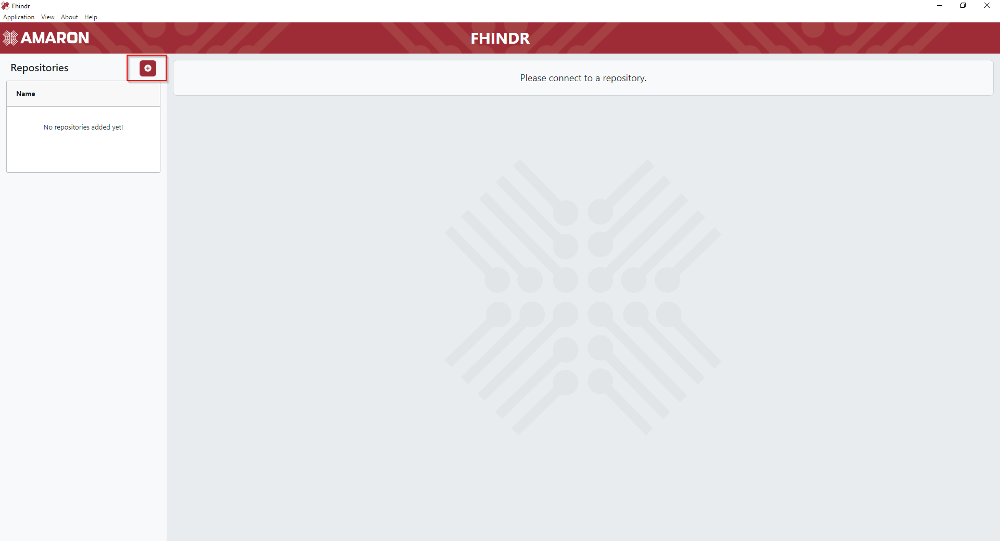
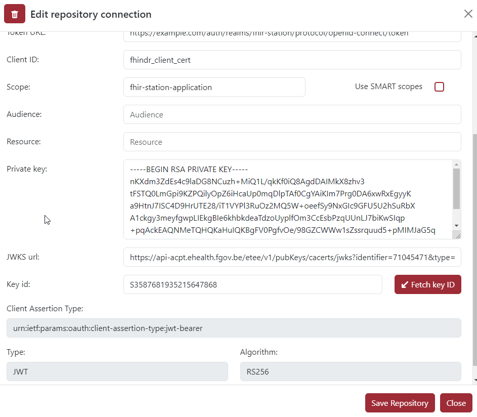
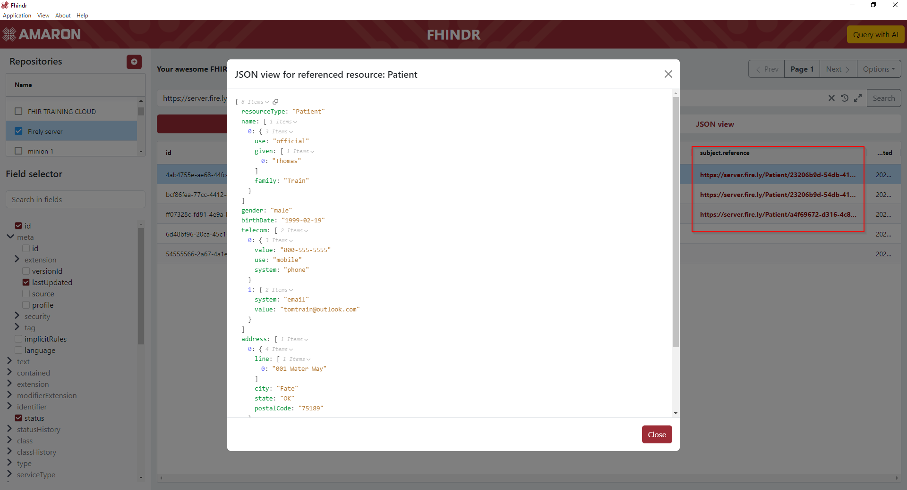

 

# Fhindr

[![Github Tag][github-tag-image]][github-tag-url]

- [Introduction](#introduction)
- [Installation](#installation)
- [User guide](#user-guide)
- [Known limitations](#known-limitations)
- [Support](#support)

## Introduction

Fhindr is a visualization tool for FHIR (Fast Healthcare Interoperability Resources) created by Amaron. It was designed to make getting an overview
of the contents of a FHIR repo easy and fast.
Without the need of manually querying the repository using a REST client.

## Installation

Fhindr is available for Windows and Mac, installers for the latest release can be found [here](https://github.com/amaron-team/fhindr/releases/latest).

## User guide

When starting the application, a new repository connection can be added by pressing the + button in the top left.

 

### Authentication

Fill out the required connection details, currently there are 2 supported methods of authenticating with a FHIR repository.
Based on what type of authentication is chosen, the required fields will vary. 
_(If the repository doesn't require authentication, name and base url will be the only required fields.)_

- Client secret authentication: Easiest and most well know authentication, only requires a client id and secret. Depending on the repository, scope and
- audience might be required.  
  

 

- Private key JWT: Most secure authentication, but not supported by all FHIR repositories, requires a private and public (jwks) key.  
  

 

### Visualizing data

After saving the new repository, it will now be available for connection in the repository table. Clicking the name of the repository once will activate the connection and
open up the query window. **Double-clicking** the name will open the configuration back up in case any connection parameters need to be updated. When editing the existing
repo connection there will also be a trash icon in the top left to delete the repository from the list of known connections.

With the query editor now available, you can select the base resource you would like to visualize and add any additional FHIR query. Selecting a resource will display the
field selector and pre-fill the query field.

In the field selector you can customize exactly how you would like the FHIR resource to be displayed. Selecting any field from the resource tree will visualize it table form.

By clicking search the repository will be queried and the selected fields will be displayed. Any field selection change will update the table live.
You can easily switch between the table view and the raw JSON representation of the FHIR resource by clicking the tabs.

 

### Data interaction

To see the detailed JSON view of a specific record, any record can be **double-clicked**

Additionally, some FHIR resources can contain special fields, these fields can be interacted with.

- Links to FHIR definitions  => These will be highlighted in blue and can be clicked to take you directly to the link.
   
   
    
- FHIR references to linked resources 
  => These will be highlighted in red and can be clicked to show the JSON view of the linked resource without having to manually query the repository again
   
   
    

### AI integration

Since it can be quite hard to know exactly what queries to write, we added an AI integration that can help write the FHIR queries.
When connected to a repository a "Query with AI" button will appear in the top right.

Currently, there are 2 supported AI models that can be used. gpt-3.5-turbo-0125 and gpt-4o You will need an API key to use these models.
The keys can be obtained [here](https://platform.openai.com/settings/organization/billing/overview) and the keys can be configured by clicking on the gear icon.

  

When the key is configured, you can just describe the query you would like and the AI model will generate the query for you. Some example questions are already present.

  

Keep in mind that AI models can make mistakes, so some small syntax errors might be possible. You can always press the generate button again to let the model retry the question.

  

By clicking on "Try it out", the query will automatically be filled in the query editor and the data can be requested.

## Known limitations

- Currently, the table view for include and revinclude queries is not supported yet, you can still see the included resources in the JSON view, but in the table only the base resource that was queried will appear.
  When using a query that will contain includes, a warning message will appear that table view is not supported yet.  
    

- Extension are only supported one level deep. When selecting fields in the field selector, you can only go one level deep. In FHIR, extensions can contain fields that also contain extensions.
  To avoid a selection tree that can keep clicking open infinitely, the extensions within extensions have been removed from selection.

## Support

Bugs or problems while using Fhindr can be reported on our [issues page.](https://github.com/amaron-team/fhindr/issues)

[github-tag-image]: https://img.shields.io/github/v/tag/amaron-team/fhindr.svg?label=Version&sort=semver
[github-tag-url]: https://github.com/amaron-team/fhindr/releases/latest
